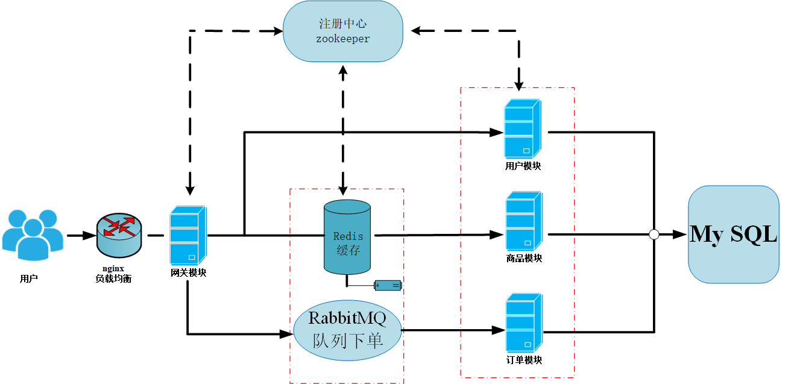
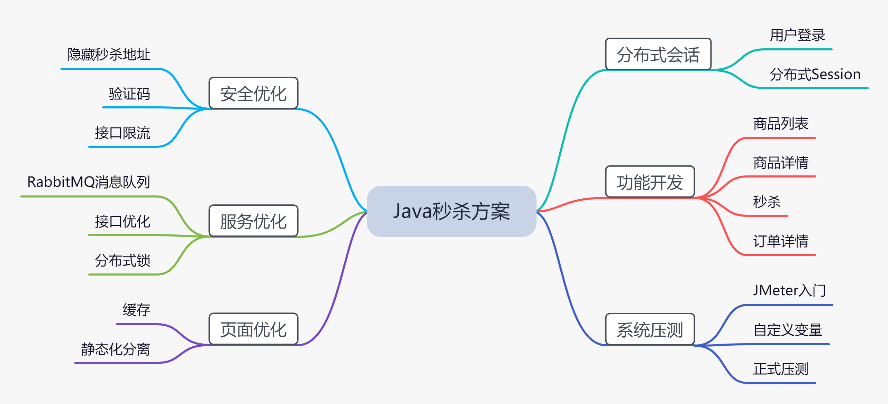

分布式高并发商品秒杀系统

- [介绍](#介绍)
- [快速启动](#快速启动)
- [项目架构图](#项目架构图)
- [项目入门](#项目入门)
- [`TODO`](#TODO)
- [Q&A](#Q&A)
- [参考资料](#参考资料)


## 介绍

本项目是在[`dis-seckill`](https://github.com/Grootzz/dis-seckill)上改进，项目名含义为分布式秒杀系统。采用微服务思想，意在提高秒杀系统的整体性能。

#### 改进点：

- [x] 优化秒杀流程，提高单机系统性能瓶颈。参考[`dis-seckill-test`](https://github.com/parkt90/dis-seckill-test)

- [x] [接口安全优化](doc/接口安全优化.md)

- [x] [系统限流与降级服务](doc/系统限流与降级服务.md)

- [x] [`Nginx`水平扩展网关模块与限流配置](doc/系统限流与降级服务.md)

#### 秒杀系统应具备要求

1. **高性能**。秒杀涉及大量的并发读和并发写，因此支持高并发访问这点非常关键。对应的方案比如动静分离方案、热点的发现和隔离、请求的削峰与分层过滤、服务端的极致优化。
2. **一致性**。秒杀中商品减库存的实现方式同样关键。有限数量的商品在同一时刻被很多倍的请求同时来减库存，减库存又分“拍下减库存"”付款减库存“以及预扣几种。系统需要在大并发更新的过程中要保证数据的准确性。
3. **高可用**。现实中难免出现一些我们考虑不到的情况，所以要保证系统的高可用性和正确性，我们还需要设计一个planB来兜底，以便应对一些意外情况。比如高并发情况下服务的熔断和降级。

## 快速启动

- 构建工具

  | ⚔️                                                 |
  | ------------------------------------------------- |
  | [`apache-maven-3.6.1`](https://maven.apache.org/) |

- 开发环境

  |                    🏖                     |                              🧐                               |                              🥇                               |                            🌁                             |                              🌈                               |                              🎯                               |                       🦄                        |                              🏖                               |                      🚏                       |
  | :--------------------------------------: | :----------------------------------------------------------: | :----------------------------------------------------------: | :------------------------------------------------------: | :----------------------------------------------------------: | :----------------------------------------------------------: | :--------------------------------------------: | :----------------------------------------------------------: | :------------------------------------------: |
  | [`Java1.8`](https://www.java.com/zh-CN/) | [`SpringBoot 2.1.5`](https://spring.io/projects/spring-boot) | [`MyBatis 2.0.1`](https://mybatis.org/mybatis-3/zh/index.html) | [`Mysql 8.0.12`](https://dev.mysql.com/downloads/mysql/) | [`Dubbo 2.7.1`](https://github.com/zaiyunduan123/Java-Interview/blob/master/notes/framework/Dubbo.md) | [`Zookeeper 3.4.10`](https://github.com/zaiyunduan123/Java-Interview/blob/master/notes/framework/Zookeeper.md) | [`Rabbitmq 3.7.15`](https://www.rabbitmq.com/) | [`Redis  5.0.5`](https://github.com/zaiyunduan123/Java-Interview/blob/master/notes/database/Redis.md) | [`jmeter 5.4.1`](https://jmeter.apache.org/) |
  |                    🍻                     |                              🚀                               |                              📮                               |                                                          |                                                              |                                                              |                                                |                                                              |                                              |
  |   [`Nginx`](https://www.nginx.cn/doc/)   |        [`Sentinel`](https://sentinelguard.io/zh-cn/)         |          [`Thymeleaf`](https://www.thymeleaf.org/)           |                                                          |                                                              |                                                              |                                                |                                                              |                                              |

在运行秒杀系统之前，需要安装好上述构建工具和开发环境，并开启相应组件后。

修改`mysql`数据库配置，连接、账户和密码。

```properties
spring.datasource.url=jdbc:mysql://localhost:3306/seckill?useUnicode=true&characterEncoding=utf-8&allowMultiQueries=true&useSSL=false&serverTimezone=GMT%2B8
spring.datasource.username=root
spring.datasource.password=123
```

**第一步**；执行`dis-seckill-common/schema/seckill.sql`文件，初始化数据库。

**第二步**；如果安装了git，则可以采用下面的方式快速启动；

```properties
git clone https://github.com/parkt90/dis-seckill.git
mvn clean package
```
启动缓存服务：

```properties
java -jar dis-seckill-cache/target/dis-seckill-cache-0.0.1-SNAPSHOT.jar
```

启动用户服务：

```properties
java -jar dis-seckill-user/target/dis-seckill-user-0.0.1-SNAPSHOT.jar
```

启动订单服务：

```properties
java -jar dis-seckill-order/target/dis-seckill-order-0.0.1-SNAPSHOT.jar
```

启动商品服务：

```properties
java -jar dis-seckill-goods/target/dis-seckill-goods-0.0.1-SNAPSHOT.jar
```

启动消息队列服务：

```properties
java -jar dis-seckill-mq/target/dis-seckill-mq-0.0.1-SNAPSHOT.jar
```

启动网关服务：

```properties
java -jar dis-seckill-gateway/target/dis-seckill-gateway-0.0.1-SNAPSHOT.jar
```

> 注：启动服务时最好按上面的顺序启动。

如果将项目导入IDE中进行构建，则分别按上面的顺序启动服务模块主程序即可。

**第三步**；访问项目入口地址

<http://localhost:8082>

初始用户手机号码：13111897391，密码：000000

## 项目架构图




## 项目入门

- **模块介绍**
  
  - `dis-seckill-common`：通用模块
  - `dis-seckill-user`：用户模块
  - `dis-seckill-goods`：商品模块
  - `dis-seckill-order`：订单模块
  - `dis-seckill-gateway`：网关模块
  - `dis-seckill-cache`：缓存模块
  - `dis-seckill-mq`：消息队列模块
  
     用户请求全部交由`Gateway`模块处理，`Gateway`模块使用`RPC`（远程过程调用）的方式调用其他模块提供的服务完成业务处理。
  
- **秒杀流程图**


- **秒杀方案介绍**： 

 


- **前端文件资源路径**：`dis-seckill-gateway\src\main\resources\`

## `TODO`

- [x] [项目基本技术点](doc/项目基本技术点.md);
- [x] **[秒杀流程优化](https://github.com/parkt90/dis-seckill-test)**；
- [x] **[接口安全优化](doc/接口安全优化.md)**；
- [x] **[系统限流与降级服务](doc/系统限流与降级服务.md)**;
- [x] **[`Nginx`水平扩展网关模块与限流配置](doc/nginx.md)**;

## Q&A

| Q&A                                                          |
| ------------------------------------------------------------ |
| [前后端交互接口定义](doc/前后端交互接口定义.md)              |
| [前后端交互接口逻辑实现](doc/前后端交互接口逻辑实现.md)      |
| [`Redis`中存储的数据](doc/Redis中存储的数据.md)              |
| [使用分布式锁解决恶意用户重复注册问题](doc/使用分布式锁解决恶意用户重复注册问题.md) |
| [拦截器`HandlerInterceptor`的使用](doc/HandlerInterceptor的使用.md) |
| **[`Rabbitmq`如何保证消息的可靠投递（近期更新）](doc/Rabbitmq.md)** |
| **[`redis`和`mysql`如何实现双删一致性（近期更新）](doc/双删一致.md)** |
| **[限流的的原理和项目中使用(近期更新)](doc/限流原理.md)**    |

## 参考资料

- B站视频资料（侵删）
  - [2021最新吃透电商项目秒杀系统-`SpringBoot、Redis`轻松实现Java高并发秒杀系统](https://www.bilibili.com/video/BV1Cp4y1b7Je?share_source=copy_web)
  - [JAVA进阶（高并发商城秒杀项目）](https://www.bilibili.com/video/BV1Ha4y1e7Uj?share_source=copy_web)
  - [2019最新`springboot`商城秒杀系统优化教程](https://www.bilibili.com/video/BV1QJ411e78B?share_source=copy_web)

- 慕课网正版网课链接
  - [Java秒杀系统方案优化 高性能高并发实战](https://coding.imooc.com/class/168.html)

- 参考项目
  - [`dis-seckill`](https://github.com/Grootzz/dis-seckill)
  - [`seckill`](https://github.com/Grootzz/seckill)
  - [`miaosha_Shop`](https://github.com/MaJesTySA/miaosha_Shop)
  - [`springboot-seckill`](https://github.com/zaiyunduan123/springboot-seckill)


